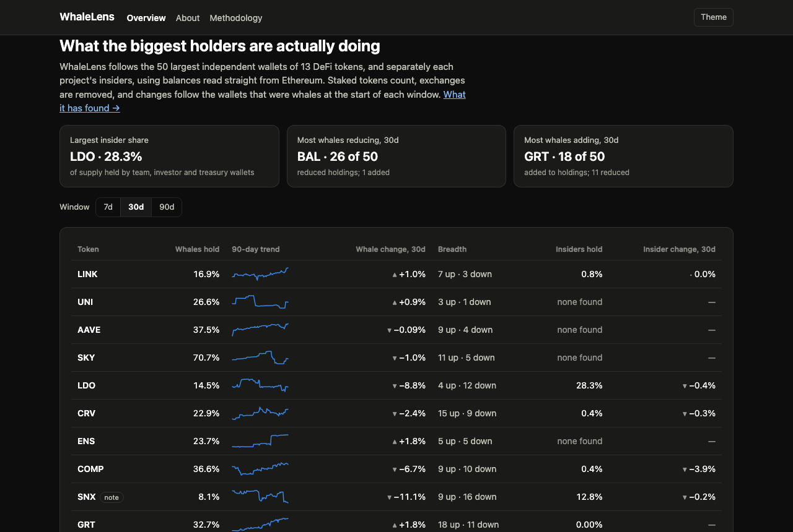
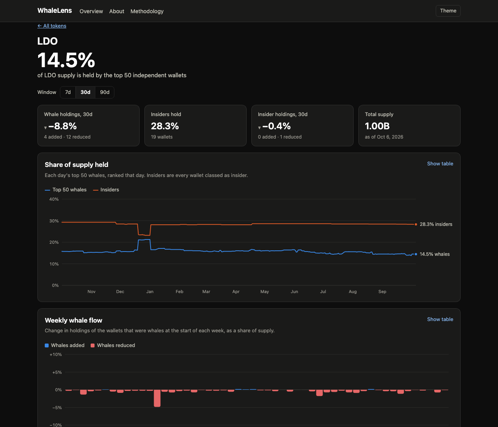

# WhaleLens

**Live site: [sachinudeshi22-alt.github.io/whalelens](https://sachinudeshi22-alt.github.io/whalelens/)**

What the largest independent holders, and each project's own insiders, of 13 DeFi
tokens are actually doing. Every number is read directly from Ethereum and updated daily.



## Why it exists

A token's top-holder list on a block explorer doesn't tell you whether big holders
are buying or selling:

- It's full of exchanges, team wallets and staking contracts.
- It misses tokens that are staked, so staking looks like selling.
- Looking back at *today's* top holders builds in fake accumulation, because they're
  at the top precisely because they ended up with the most.

WhaleLens fixes each of these. See [About](https://sachinudeshi22-alt.github.io/whalelens/about.html)
for what it has found, including a 236-million-token Synthetix mint traced on-chain,
and the case where the naive view showed +28% accumulation when the real figure was −3.5%.



## What it does

- **Verifies every balance on-chain.** Third-party holder data is only used to find
  candidates. In testing, that data overstated one token's holdings 12-fold.
- **Counts staked tokens** across seven staking systems: SKY lockstake, veCRV,
  stkAAVE, LINK staking, veBAL, xSUSHI and st1INCH.
- **Removes exchanges and exchange-like wallets** using public labels plus transfer
  behaviour.
- **Tracks insiders separately.** Team, investor, treasury and vesting wallets are
  identified from evidence, and the reason is published for each one.
- **Uses point-in-time cohorts.** A past date's whales are that date's top 50, and
  every date carries a completeness proof that no wallet outside the candidate set
  could have ranked in it.

Tokens: LINK, UNI, AAVE, SKY, LDO, CRV, ENS, COMP, SNX, GRT, 1INCH, SUSHI, BAL.
Every rule and known limitation is in [docs/METHODOLOGY.md](docs/METHODOLOGY.md).
Not financial advice.

## How it's built

```
Ethereum archive node (Alchemy) ──┐   Multicall3 batches thousands of balance reads per call;
Blockscout + Open Labels ─────────┤   a year of transfers is scanned to find past whales
                                  ▼
             Python pipeline (scripts/run_daily.py), SQLite
                                  │   holdings → staking positions → exclusions →
                                  │   insiders → point-in-time cohorts → export
                                  ▼
             Static site (HTML/CSS/JS, hand-built SVG charts) on GitHub Pages
```

A GitHub Actions workflow ([.github/workflows/daily.yml](.github/workflows/daily.yml))
runs the pipeline every day. The SQLite database (about 500 MB compressed) lives as an
asset on this repo's `data` release, because it's too large for git. Everything runs
on free tiers.

| Step | Script |
|---|---|
| Record the day's holdings, staking included | `backfill_history.py` |
| Extend the year-long transfer scan | `scan_transfers.py` |
| Refresh holder candidates (weekly) | `fetch_holders.py` |
| Build point-in-time whale and insider cohorts | `build_cohorts.py` |
| Export site data and pages | `export_site.py` |
| Prune and compact the database (weekly) | `prune_db.py` |

### Running locally

```bash
python3.12 -m venv .venv
.venv/bin/pip install -r requirements.txt
cp .env.example .env    # add ETH_RPC_URL (an Alchemy endpoint) and BLOCKSCOUT_API_KEY
.venv/bin/python scripts/run_daily.py
.venv/bin/python -m http.server 8765 --directory site
```

## Roadmap

1. **Where the tokens went.** Split each whale balance change into exchange deposits,
   DEX trades, bridging and staking.
2. **Track record.** Score wallets by how well their past moves timed the price.
3. **Testing the signal.** Check whether whale or insider moves predict returns, and
   publish the result either way.

---

Built by [Sachin Udeshi](https://github.com/sachinudeshi22-alt).
